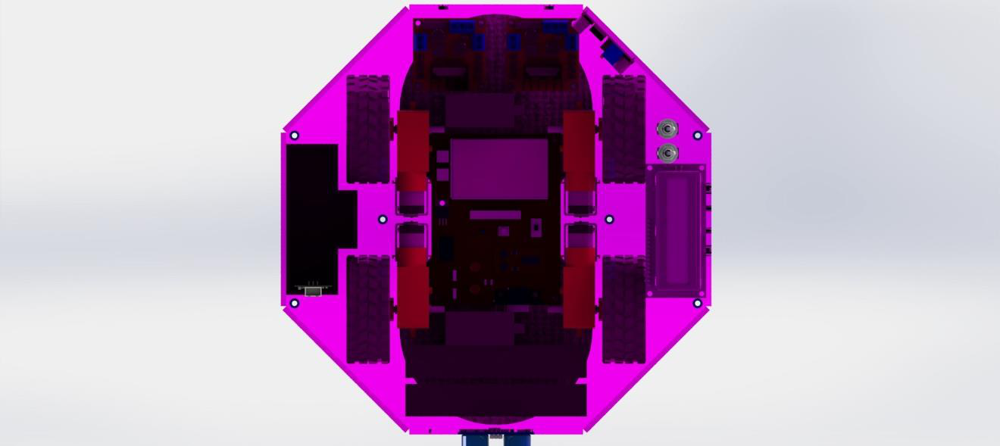
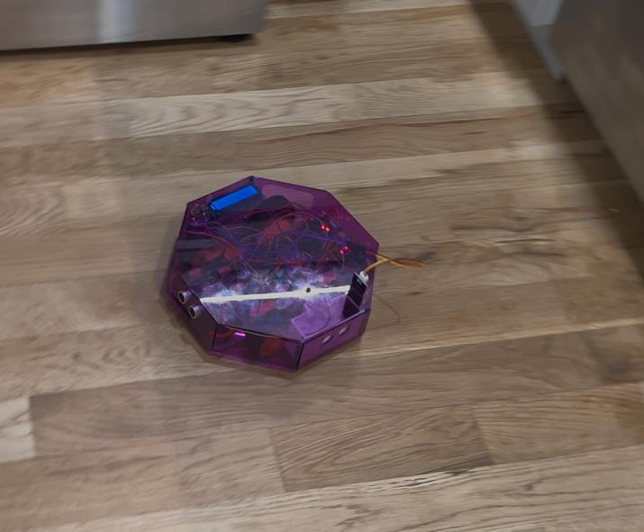
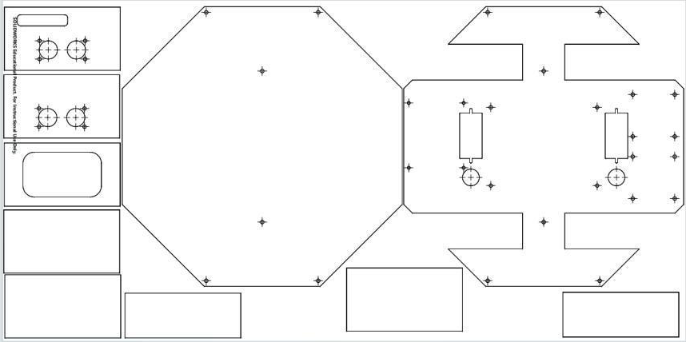
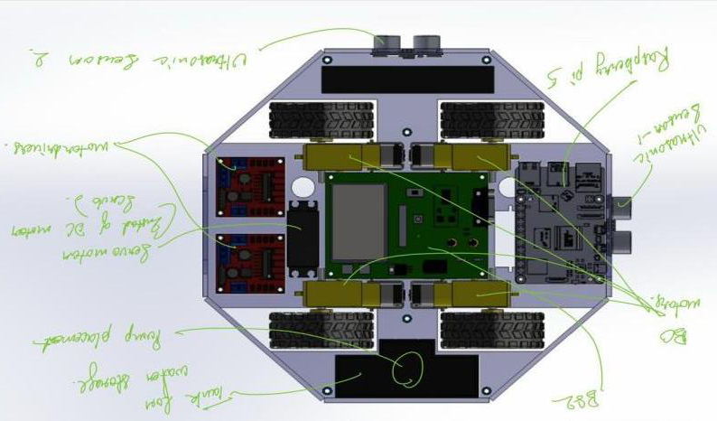
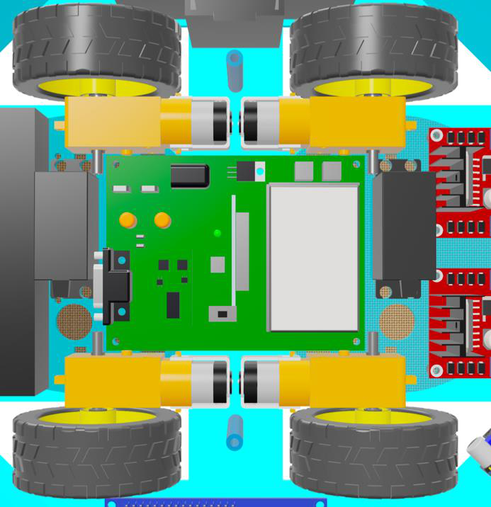

# Smart Cleaning Robot

[](#)
[](https://www.parallax.com/product/basic-stamp-2-module/)
[](#)
[](#)

An autonomous floor-cleaning robot built on a Parallax BASIC Stamp 2. The bot drives in a skid-steer layout, scans for obstacles with an ultrasonic sensor, and switches between **wet mopping** and **dry sweeping** modes based on a capacitive moisture sensor mounted in the cleaning sponge. Built as a team project for **NYU Tandon ME-GY 5103 — Mechatronics**.

> **Team 4** — Tarunkumar Palanivelan · Abirami Palaniappan Sirsabesan · Mercer Wu

## Demo

<!-- Drag-and-drop assets/smart_cleaner_demo.mp4 here in the GitHub web editor to embed -->

https://github.com/tarunkumarnyu/Smart-Cleaner/raw/main/assets/smart_cleaner_demo.mp4

<p align="center">
  
</p>

<p align="center">
  
</p>

## Behaviour

<p align="center">
  
</p>

The control loop runs forever on the BS2 and does five things on each pass:

1. **Sponge moisture check** — RC-time read on the capacitive sensor inside the sponge.
   - `RCTIME > 11600` → sponge is **dry** → switch to **DRY CLEAN MODE**, stop the water pump, and prompt the user to refill.
   - else → sponge is **wet** → stay in **WET CLEAN MODE** and run the pump to keep the sponge saturated.
2. **Rear mopping servo** — sweeps a standard servo between 0° and 180° (50 PULSOUT pulses each direction).
3. **Front sweeper** — ticks the continuous-rotation brush servo.
4. **Ultrasonic ranging** — single trigger/echo pulse on a HC-SR04 line, converted to centimetres via the BS2 `**` operator.
   - `distance ≤ 50 cm` → in-place **right turn** (left side forward, right side reverse).
   - else → **drive forward** with PWM on both sides.
5. Loop.

The right-turn-on-obstacle policy implements a deliberately simple **wall-following / area-coverage** pattern: in an enclosed room a few iterations of forward + 90° right cover the floor without any path planner.

<p align="center">
  
</p>

## System Architecture

<p align="center">
  
</p>

The BS2 sits at the centre, talking to:

- **HC-SR04 ultrasonic sensor** — single-pin trigger + echo (`PULSOUT` then `PULSIN`).
- **Capacitive moisture sensor** in the sponge — read via `RCTIME` on the same line as the pump enable.
- **Two motor drivers** (one per side of the robot) controlling the four drive motors via direction pins + PWM.
- **Standard servo** on pin 15 — rear mopping arm.
- **Continuous-rotation servo** on pin 8 — front sweeper.
- **DC water pump** through its own H-bridge channel (pins 6/7).
- **Parallax 2×16 serial LCD** on pin 0 — `SEROUT` at baudmode `84` (9600 8N1 inverted).
- **Two batteries**: one for logic + sensors, one for the drive train, isolated to keep motor noise off the BS2.

### Pin map

| Pin | Direction | Function |
|---|---|---|
| 0 | OUT | Serial LCD TX (`SEROUT 0, 84, …`) |
| 6 | OUT | Water-pump H-bridge IN1 |
| 7 | OUT | Water-pump H-bridge IN2 |
| 8 | OUT | Front sweeper (continuous servo) |
| 9 | I/O | Capacitive moisture sensor (`RCTIME`) |
| 10 | I/O | HC-SR04 SIG (trigger + echo) |
| 11 | OUT | Side B reverse |
| 12 | OUT | Side B forward |
| 13 | OUT | Side A reverse |
| 14 | OUT | Side A forward |
| 15 | OUT | Rear mopping servo (standard) |

### Drive truth table

| State | A_Fwd | A_Rev | B_Fwd | B_Rev | Result |
|---|:---:|:---:|:---:|:---:|---|
| Forward | 1 | 0 | 1 | 0 | Drive straight |
| Right turn | 1 | 0 | 0 | 1 | Pivot in place |

## Mechanical Design

The chassis is a **laser-cut acrylic** octagonal shell with **3D-printed** screw posts and water-tank brackets. The acrylic was chosen for transparency (so the internals are visible during demo) and for laser-cuttability — the entire shell comes from a single 24"×12" sheet.

<p align="center">
  
  <br/><em>Single 24"×12" acrylic sheet — every panel of the shell nests on one cut.</em>
</p>

<p align="center">
  
  <br/><em>Top-down component layout with hand-annotated callouts.</em>
</p>

<p align="center">
  
  <br/><em>Underside: four drive motors and the two motor-driver boards.</em>
</p>

- **Drive layout**: 4× DC motors with rubber wheels in a skid-steer arrangement. Two motor drivers, one per side, so left and right pairs always spin together.
- **Cleaning end-effectors**: front sweeper (continuous servo + brush) and rear mopper (standard servo + sponge). The sponge has the moisture sensor embedded so the controller knows when to top up.
- **Water system**: tank → DC pump → silicone tubing to the sponge. Pump is gated on the moisture reading so the sponge is rewetted only when it actually needs it.
- **Power**: dual battery — one Li-ion pack for the BS2 + sensors, one for the drive motors and pump. Buck converter steps the drive battery down to the BS2's 5 V rail when needed.

## Bill of Materials

| Component | Qty | Cost |
|---|---:|---:|
| Parallax BASIC Stamp 2 | 1 | $235 |
| Water pump | 1 | $6 |
| Ultrasonic sensor (HC-SR04) | 1 | $5 |
| Motor driver | 2 | $6 |
| DC motor | 4 | $5 |
| Motor wheel | 4 | $4 |
| Servo motor | 2 | $8 |
| Li-ion battery | 1 | $10 |
| Capacitive moisture sensor | 1 | $2 |
| 10 kΩ resistor | 1 | $1 |
| 0.1 µF capacitor | 1 | $1 |
| Water tank (3D printed) | 1 | $2 |
| Cleaning brush | 2 | $2 |
| Jumper wires | — | $5 |
| Acrylic shell | — | $15 |
| **Prototype total** | | **≈ $307** |

The BASIC Stamp dominates the BoM. A mass-production version would migrate the firmware to a sub-$5 microcontroller and replace the laser-cut shell with injection moulding; the report estimates a per-unit cost of **≈ $280** at a batch of 100.

## Firmware

The full PBASIC source is in [`firmware/smart_cleaner.bs2`](firmware/smart_cleaner.bs2). It is a single-file program structured as:

- Constants and pin map
- `Main:` loop — moisture check, mopping sweep, ultrasonic ranging, drive decision
- `MoveForward:` and `TurnRight:` subroutines

Flash it with the **Parallax PBASIC Editor** (free from parallax.com) over the BS2's serial programming cable.

## Repository Layout

```
.
├── README.md
├── firmware/
│   └── smart_cleaner.bs2          # PBASIC source (commented)
├── docs/
│   └── Smart_Cleaner_Report.pdf   # Full design report
└── assets/
    ├── workflow.svg / workflow.png
    ├── wiring_overview.png
    ├── navigation_pattern.png
    ├── component_layout.png
    ├── laser_cut_cad.png
    ├── shell_render.png
    ├── chassis_underside.png
    ├── assembled_robot.png
    ├── market_reference.png
    └── smart_cleaner_demo.mp4
```

## Limitations & Future Work

- **Coverage** is open-loop (forward-until-bump, then turn right). A real Roomba-style spiral or wall-follow would cover the floor much more reliably.
- **Battery life** is short — the BS2 + dual servos + pump + four DC motors draw enough that runtime is limited.
- **Cleaning effectiveness** on entrenched dirt is modest. Adding a vacuum module or replacing the brushes would help.
- **Cost** is dominated by the BS2; porting to an Arduino Nano or ESP32 would cut the BoM by an order of magnitude.

## Course

ME-GY 5103 — Mechatronics, NYU Tandon School of Engineering. Final-project submission, Group 4.
