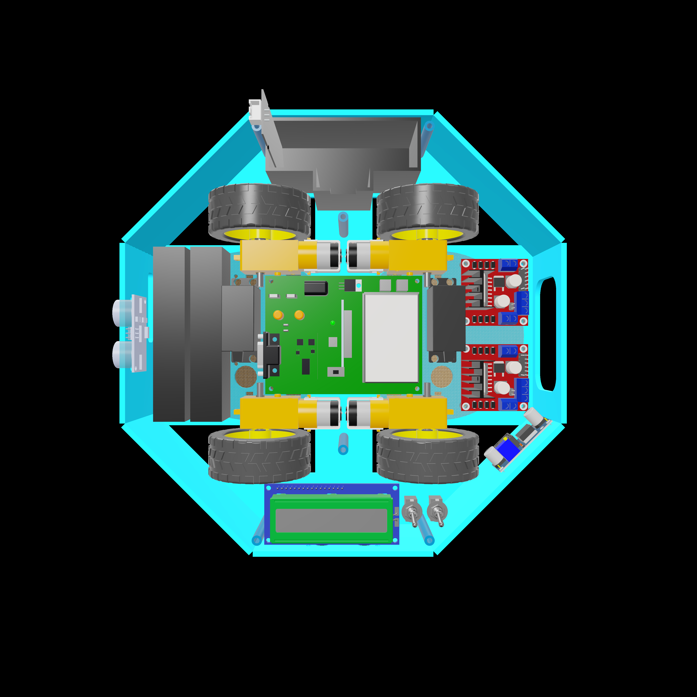
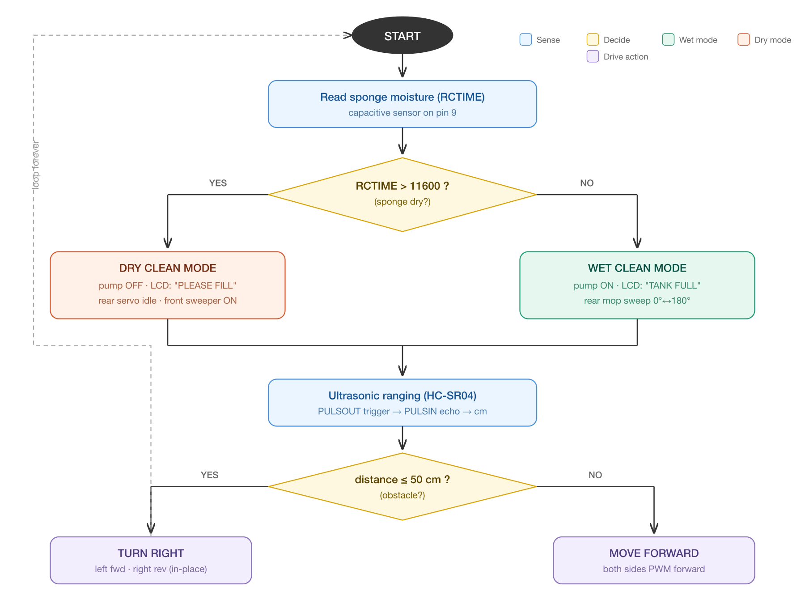
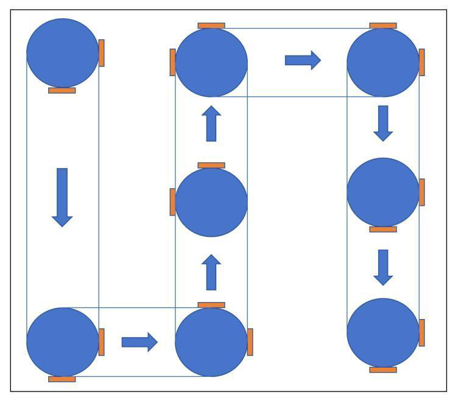
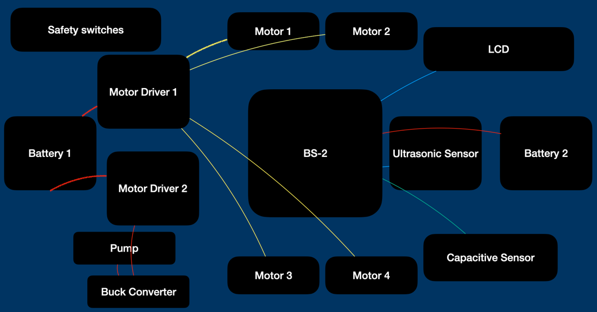
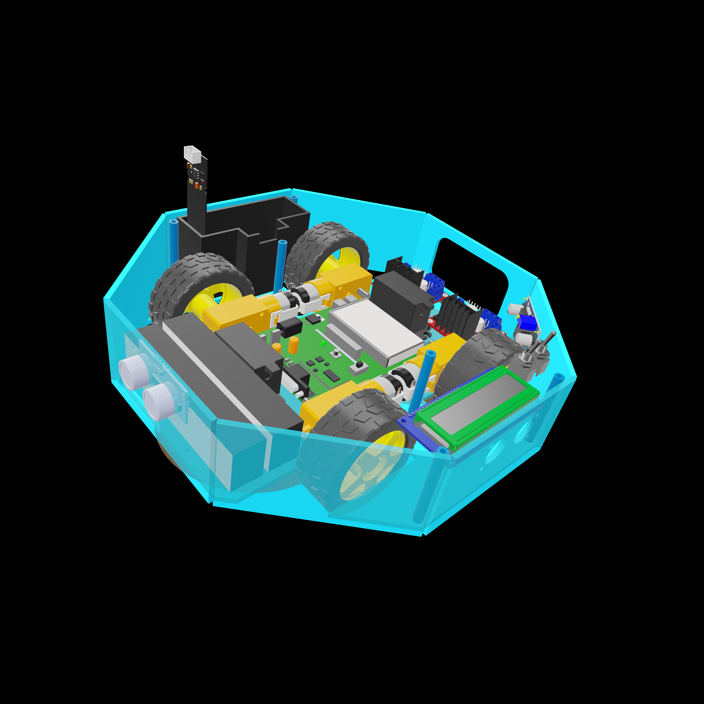
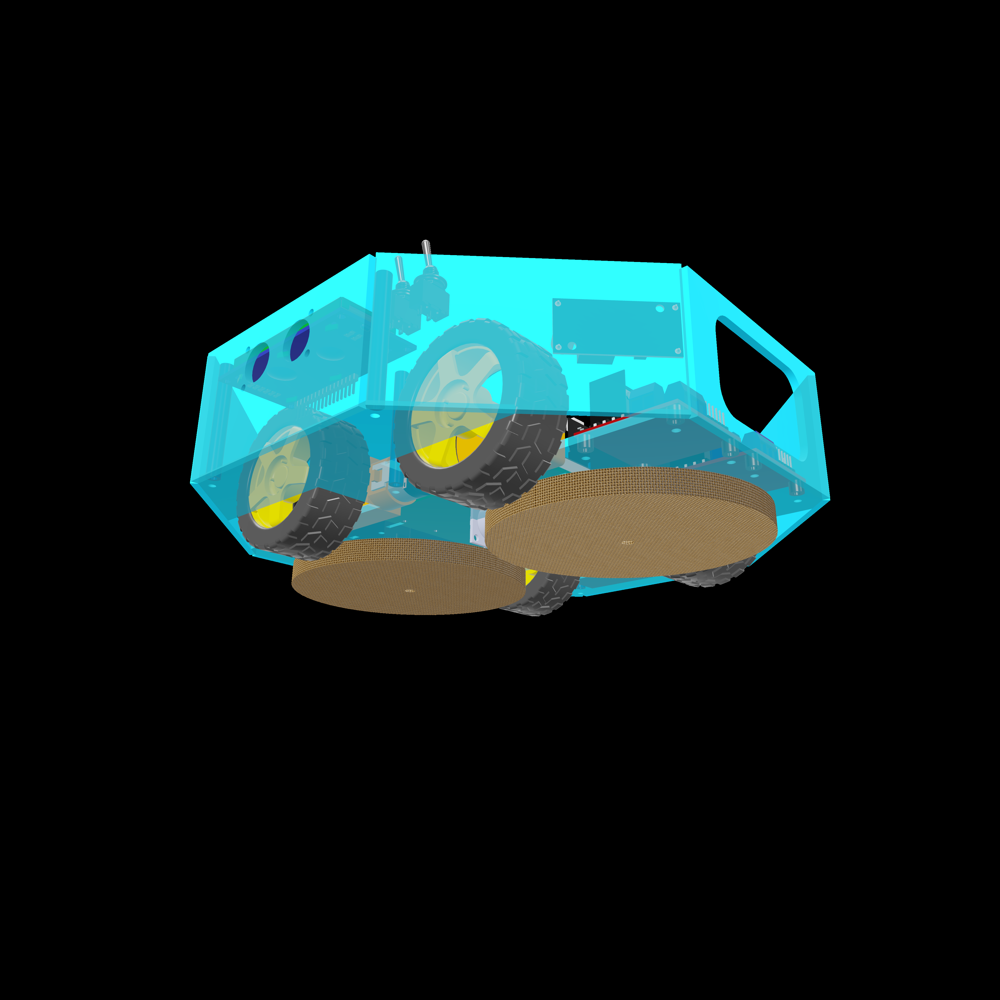

# Smart Cleaning Robot

[](#)
[](https://www.parallax.com/product/basic-stamp-2-module/)
[](#)
[](#)

An autonomous floor-cleaning robot built on a Parallax BASIC Stamp 2. The bot drives in a skid-steer layout, scans for obstacles with an ultrasonic sensor, and switches between **wet mopping** and **dry sweeping** modes based on a capacitive moisture sensor mounted in the cleaning sponge. Built as a team project for **NYU Tandon ME-GY 5103 — Mechatronics**.

> **Team 4** — Tarunkumar Palanivelan · Abirami Palaniappan Sirsabesan · Mercer Wu

## Demo

<!-- Drag-and-drop assets/smart_cleaner_demo.mp4 here in the GitHub web editor to embed -->

https://github.com/tarunkumarnyu/Smart-Cleaner/raw/main/assets/smart_cleaner_demo.mp4

<p align="center">
  
</p>

## Why

Floor cleaning is the kind of housework that wrecks your back and your knees — long hours of bending, awkward postures, repetitive twisting. Rooms come in every shape and size, with different floors and different furniture, and yet the only "scalable" answer most people have is *more human effort*. The goal of this project was to build a small, fully autonomous cleaning robot that handles the boring case (sweep + mop a flat indoor floor) without anyone having to push it around.

## Behaviour

<p align="center">
  
</p>

The control loop runs forever on the BS2 and does five things on each pass:

1. **Sponge moisture check** — RC-time read on the capacitive sensor inside the sponge.
   - `RCTIME > 11600` → sponge is **dry** → switch to **DRY CLEAN MODE**, stop the water pump, and prompt the user to refill.
   - else → sponge is **wet** → stay in **WET CLEAN MODE** and run the pump to keep the sponge saturated.
2. **Rear mopping servo** — sweeps a standard servo between 0° and 180° (50 PULSOUT pulses each direction).
3. **Front sweeper** — ticks the continuous-rotation brush servo.
4. **Ultrasonic ranging** — single trigger/echo pulse on a HC-SR04 line, converted to centimetres via the BS2 `**` operator.
   - `distance ≤ 50 cm` → in-place **right turn** (left side forward, right side reverse).
   - else → **drive forward** with PWM on both sides.
5. Loop.

The right-turn-on-obstacle policy implements a deliberately simple **wall-following / area-coverage** pattern: in an enclosed room a few iterations of forward + 90° right cover the floor without any path planner.

<p align="center">
  
</p>

The two cleaning modes show up live on the LCD:

<p align="center">
  
  &nbsp;
  
</p>

## System Architecture

<p align="center">
  
</p>

The BS2 sits at the centre, talking to:

- **HC-SR04 ultrasonic sensor** — single-pin trigger + echo (`PULSOUT` then `PULSIN`).
- **Capacitive moisture sensor** in the sponge — read via `RCTIME` on the same line as the pump enable.
- **Two motor drivers** (one per side of the robot) controlling the four drive motors via direction pins + PWM.
- **Standard servo** on pin 15 — rear mopping arm.
- **Continuous-rotation servo** on pin 8 — front sweeper.
- **DC water pump** through its own H-bridge channel (pins 6/7).
- **Parallax 2×16 serial LCD** on pin 0 — `SEROUT` at baudmode `84` (9600 8N1 inverted).
- **Two batteries**: one for logic + sensors, one for the drive train, isolated to keep motor noise off the BS2.

### Pin map

| Pin | Direction | Function |
|---|---|---|
| 0 | OUT | Serial LCD TX (`SEROUT 0, 84, …`) |
| 6 | OUT | Water-pump H-bridge IN1 |
| 7 | OUT | Water-pump H-bridge IN2 |
| 8 | OUT | Front sweeper (continuous servo) |
| 9 | I/O | Capacitive moisture sensor (`RCTIME`) |
| 10 | I/O | HC-SR04 SIG (trigger + echo) |
| 11 | OUT | Side B reverse |
| 12 | OUT | Side B forward |
| 13 | OUT | Side A reverse |
| 14 | OUT | Side A forward |
| 15 | OUT | Rear mopping servo (standard) |

### Drive truth table

| State | A_Fwd | A_Rev | B_Fwd | B_Rev | Result |
|---|:---:|:---:|:---:|:---:|---|
| Forward | 1 | 0 | 1 | 0 | Drive straight |
| Right turn | 1 | 0 | 0 | 1 | Pivot in place |

## Mechanical Design

The chassis is an **octagonal acrylic shell** sized for minimum dead-space around every component. Acrylic was chosen for two reasons: it laser-cuts in one pass on a single 24"×12" sheet, and it is **transparent**, which makes the entire interior visible at a glance — useful for debugging during development and for showing off the build at demo time.

The robot is split into three functional zones, all packed inside the octagonal footprint:

- **Front bay** — ultrasonic sensor + front sweeper brush. The brush is driven by a continuous-rotation servo and acts as the dust agitator.
- **Centre bay** — Board of Education with the BS2, both motor drivers, the buck converter, and the dual battery packs. The four drive motors and yellow gearmotor mounts dominate the centreline.
- **Rear bay** — water tank, pump, and the standard servo that swings the mopping sponge through a 180° arc. The capacitive moisture sensor is embedded in the sponge so the controller knows exactly when to top up the water.

<p align="center">
  
  <br/><em>Isometric view — every component sits in its own bay inside the transparent shell.</em>
</p>

<p align="center">
  
  <br/><em>Underside — front sweeper brush and rear mopping pad both visible.</em>
</p>

### Drive train

Four DC gearmotors are arranged as a **4-wheel skid-steer**: each side runs from its own L298-style motor driver, so the left and right pairs are commanded as a single unit. Driving forward simply means both sides forward; turning is "one side forward, one side reverse" for a zero-radius pivot, which is the only thing the controller needs to escape obstacles given a forward-facing ultrasonic sensor.

### Cleaning end-effectors

| | Cleaner-1 (front) | Cleaner-2 (rear) |
|---|---|---|
| **Servo type** | Continuous rotation | Standard 0–180° |
| **Brush** | Bristle sweeper | Sponge mop |
| **Job** | Lift dust ahead of the robot | Wet-mop with a 0°↔180° sweep |
| **Always on?** | Yes — runs while the robot moves | Only in WET mode (when the sponge has water) |

### Water system

The tank sits in the rear bay above the mop. A small DC pump pulls water out through silicone tubing and feeds the sponge directly. The capacitive moisture sensor inside the sponge is read every loop iteration via `RCTIME`; when the reading crosses the dry threshold the firmware turns the pump off, drops the rear servo, and posts a "FILL WATER" message to the LCD so the user knows what to do next. There is no separate "tank empty" sensor — the sponge moisture *is* the tank-empty signal, which collapses two parts into one.

### Power tree

Two separate battery packs:
- **Logic pack** — feeds the BS2, the LCD, and the sensors. Isolated from the drive train so motor brush noise doesn't reset the microcontroller.
- **Drive pack** — feeds both motor drivers, the pump, and the two servos through an LM2596 buck converter that drops it to the regulated rail the actuators want.

External **toggle switches** sit on the rear face of the shell as the master ON/OFF for each rail — no software state, no surprises.

## Bill of Materials

| Component | Qty | Cost |
|---|---:|---:|
| Parallax BASIC Stamp 2 | 1 | $235 |
| Water pump | 1 | $6 |
| Ultrasonic sensor (HC-SR04) | 1 | $5 |
| Motor driver | 2 | $6 |
| DC motor | 4 | $5 |
| Motor wheel | 4 | $4 |
| Servo motor | 2 | $8 |
| Li-ion battery | 1 | $10 |
| Capacitive moisture sensor | 1 | $2 |
| 10 kΩ resistor | 1 | $1 |
| 0.1 µF capacitor | 1 | $1 |
| Water tank (3D printed) | 1 | $2 |
| Cleaning brush | 2 | $2 |
| Jumper wires | — | $5 |
| Acrylic shell | — | $15 |
| **Prototype total** | | **≈ $307** |

The BASIC Stamp dominates the BoM. A mass-production version would migrate the firmware to a sub-$5 microcontroller and replace the laser-cut shell with injection moulding; the report estimates a per-unit cost of **≈ $280** at a batch of 100.

## Firmware

The full PBASIC source is in [`firmware/smart_cleaner.bs2`](firmware/smart_cleaner.bs2). It is a single-file program structured as:

- Constants and pin map
- `Main:` loop — moisture check, mopping sweep, ultrasonic ranging, drive decision
- `MoveForward:` and `TurnRight:` subroutines

Flash it with the **Parallax PBASIC Editor** (free from parallax.com) over the BS2's serial programming cable.

## Repository Layout

```
.
├── README.md
├── firmware/
│   └── smart_cleaner.bs2          # PBASIC source (commented)
├── docs/
│   └── Smart_Cleaner_Report.pdf   # Full design report
└── assets/
    ├── workflow.svg / workflow.png
    ├── wiring_overview.png
    ├── navigation_pattern.png
    ├── cad_top.png
    ├── cad_iso.png
    ├── cad_underside.png
    ├── shell_render.png
    ├── assembled_robot.png
    ├── lcd_wet.png  /  lcd_dry.png
    └── smart_cleaner_demo.mp4
```

## Limitations & Future Work

- **Coverage** is open-loop (forward-until-bump, then turn right). A real Roomba-style spiral or wall-follow would cover the floor much more reliably.
- **Battery life** is short — the BS2 + dual servos + pump + four DC motors draw enough that runtime is limited.
- **Cleaning effectiveness** on entrenched dirt is modest. Adding a vacuum module or replacing the brushes would help.
- **Cost** is dominated by the BS2; porting to an Arduino Nano or ESP32 would cut the BoM by an order of magnitude.
- **Sensor suite** — a single front-facing ultrasonic gives the robot tunnel vision. Side rangers, a cliff sensor, and a floor-type sensor (the slide deck mentions adapting cleaning mode to carpet vs. tile) are the obvious next steps.

## Course

ME-GY 5103 — Mechatronics, NYU Tandon School of Engineering. Final-project submission, Group 4.
